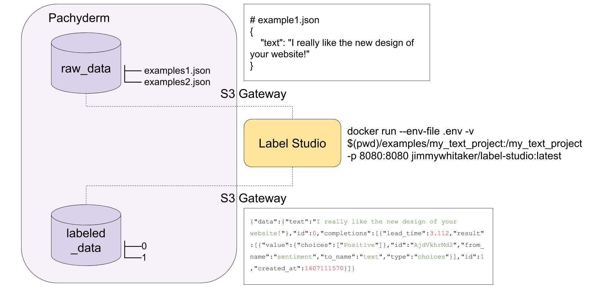

# Label Studio with Pachyderm

<p align="center">
	
</p>

[Label Studio](https://labelstud.io/) supports many different types of data labeling tasks, while Pachyderm allows you to incorporate data versioning and data-driven pipelines. This integration connects a Pachyderm versioned data backend with Label Studio to support versioning datasets and tracking the data lineage of pipelines built off the versioned datasets.

## How it works

Label Studio can utilize an s3 backend, reading data from an S3 bucket and writing labels to an output S3 location. Pachyderm has an S3 compliant gateway that allows reading data from its file system and writing data to its filesystem (organizing it with commits that can start pipelines).

We'll create a text labeling example by:

1. Start a Label Studio instance that uses Pachyderm as its backend
2. Push data to Pachyderm that automatically populates Label Studio
3. Label the data in Label Studio
4. Version our dataset in Pachyderm

Note: Label studio currently doesn't support arbitrary s3 storage (only AWS s3 and GCS), so I modified Label Studio's s3 storage backend to support generic object storage endpoints, which allows us to connect to the Pachyderm s3 gateway running locally. you can see the code [here](label_studio/storage/s3.py)

## TLDR;

``` bash
# Pachyderm Setup
pachctl create repo raw_data
pachctl create repo labeled_data
pachctl create branch labeled_data@master
pachctl create branch raw_data@master

# Start a local instance of Label Studio (needs the .env for the Pach s3 gateway)
docker run --env-file .env -v $(pwd)/examples/my_text_project:/my_text_project -p 8080:8080 jimmywhitaker/label-studio:latest

# Navigate to http://localhost:8080/tasks

# Upload data
pachctl put file raw_data@master:/test-example.json -f raw_data/test-example.json --split json --target-file-datums 1

# Modify the data before it's labeled
pachctl put file raw_data@master:/test-example.json -f raw_data/test-example2.json --split json --target-file-datums 1 --overwrite

# Label data (2 examples) in the UI

# Version your dataset (v1)
pachctl list branch labeled_data
pachctl create branch labeled_data@v1 --head master
pachctl list branch labeled_data

# Label more data in the UI

# Version your dataset (v2)
pachctl list branch labeled_data
pachctl create branch labeled_data@v2 --head master

# Download dataset for v1 locally
pachctl get file -r labeled_data@v1:/ -o labeled_data/

```

## Configuring .env file
The `.env` file needs to be configured for your Pachyderm s3 gateway. Pachyderm's s3 gateway is accessed through an `http` endpoint that is available on port `30600` on the Pachyderm cluster. This address is used to as the `ENDPOINT_URL` for the Label Studio backend in the `.env` file. 

### Minikube configuration
If you are running Pachyderm locally on minikube, you can get the `ENDPOINT_URL` for the Pachyderm s3 gateway by running the command:

```
$ minikube ip
192.168.64.8
```

<!-- ## Creating a new project
A new project requires creating a new configuration (see some of the [examples](examples/)). Creating a new project with Label Studio can be done by from the command line. We'll use the Docker image that we created to do this, adding the `--init` flag which will create the project. 

```shell
docker run --env-file .env -v $(pwd)/examples/my_new_project:/my_new_project -p 8080:8080 --entrypoint=label-studio jimmywhitaker/label-studio:latest start /my_new_project/ --source s3 --source-path master.raw_data --target s3-completions --target-path master.labeled_data --input-format=image --template image_bbox --source-params "{\"use_blob_urls\": false, \"regex\": \".*\"}"

``` -->

## Current Issues/Not Supported

Future support:The output does have a reference for what the input file location was (could potentially be used to track consistency between raw and labeled if raw changes).

We can load data into Pachyderm, label it, and output the result. 
**We can change labels and see the versions of the labels? 

### Next Steps

* Make deployment super easy
  * Build a helm chart to deploy label studio to Kubernetes with necessary env 
  * Standardize label studio project creation - different examples of configs
* Ability to update `input raw data` - currently if it's labeled, then it's captured in the source and target json files. 
* Rectify the source and target files to have provenance for the labeling


### Known Issues and Gotchas 

* One example per source file 
* Must be json files or figure out how to get s3 signed urls to frontend. 
* When file is updated after labeled, it's not re-loaded (not sure what should happen here - should it be removed from the labeled data repo when the raw data is removed?)
  * When raw data is changed after that example is labeled, the task doesn't update. It does update when 
  * It seems as though the target and the source states are tied somehow, so it won't automatically update
  * If a raw file is removed or changed, then labels associated with that file should be removed. Since it's a single file per example, a changed file should be the deleting of one and addition of another. For now, this would need to be an external process that 
* Once you've created a project and labeled data, the same starting configuration should be used. Label Studio automatically tries to start an image labeling config and if there is labeled data, this will throw errors until you load a compatible config for what's already labeled (i.e. you should not use the `--init` and `--force` flags after you've created the project).

